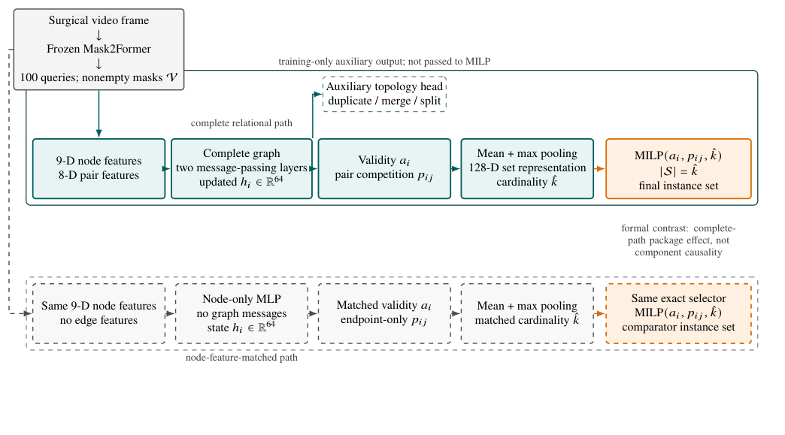

# Topology-Aware Query Selection for Surgical Instrument Instance Segmentation

**面向实例分割候选的关系建模、基数预测与精确结构化选择**

Given fixed Mask2Former candidates, this project treats final query selection as a relational, variable-cardinality structured-prediction problem rather than independent candidate scoring.

## 60 秒概览

- **问题**：像素重叠良好的候选掩码仍可能组成错误的实例集合，例如重复、碎片化、合并、漏检或空帧误激活。
- **方法**：将非空候选构造成完全图，联合建模 9 维节点特征和 8 维成对几何特征，通过两层消息传递、候选有效性/竞争关系预测和集合基数预测，最终用 MILP 选择全局一致的实例子集。
- **正式对比**：完整关系路径与节点特征匹配路径共享候选、节点描述、监督、病例划分、训练种子、基数机制与精确选择器。
- **公开范围**：仓库覆盖候选生成之后的图构造、模型、训练合同、精确选择和评估；原始临床图像、候选缓存、模型权重及固定上游 Mask2Former 不公开。



## 关键结果

| 证据集 | 结果 | 可以支持的结论 |
|---|---|---|
| 密封源域测试（22 cases） | 三个发现种子的实例 F1 提升 **5.04–6.12 个百分点**；正帧集合失败率下降 **8.48–10.60 个百分点** | 在分割保真和预定义技术安全保持的条件下，完整路径改善实例集合构造 |
| ROBUST-MIPS（30 cases，4,057 frames） | 三个随机种子均满足完整判定条件 | 支持在该数据域上的直接迁移 |
| Endoscapes（10 cases，74 frames） | 仅一个随机种子满足完整判定条件 | 不支持稳定或普遍的跨域迁移 |

这些结果识别的是**完整关系路径的整体效果**，不能将提升单独归因于关系特征、消息传递、基数预测或额外模型容量。完整数字与结论边界见[结果与边界](docs/05_结果与边界.md)。

## 代码中能看到什么

| 能力 | 代码证据 |
|---|---|
| 视觉候选到结构化表示 | `build_candidate_graph`：候选掩码、节点特征、成对几何与图结构 |
| 图模型与集合建模 | `TopologyAwareCandidateGraph`、`_MessageLayer`、集合池化与基数头 |
| 公平对比 | `NodeOnlyMLP`：节点特征匹配路径 |
| 多任务训练 | `multitask_loss`：有效性、拓扑、竞争关系与基数监督 |
| 精确结构化决策 | `exact_structured_select`：带基数和候选竞争约束的 MILP |
| 实验与复现治理 | 病例隔离划分、冻结协议、运行回执、SHA-256 清单和自动化测试 |

论文概念与函数的对应关系见[代码架构](docs/03_代码架构.md)。

## 快速验证

参考环境为 Python 3.10+。最小示例使用三个合成候选，不需要临床数据、模型权重或 GPU。

```powershell
python -m venv .venv
python -m pip install -e ".[dev]"
python scripts/check_all.py
```

也可以分别运行：

```powershell
python scripts/verify_release.py
python scripts/smoke_test.py
python -m structured_instance_selection
python -m pytest -q
```

成功的冒烟测试会依次完成候选图构造、关系路径/节点路径前向传播和 MILP 精确选择。

## 代码入口

```text
src/structured_instance_selection/
├── rid_qgraph_core.py          候选图、两条模型路径、多任务损失、MILP
├── rid_qgraph_train_group.py   源域开发集训练与评估
├── rid_qgraph_a2_train_group.py
│                               A2 监督消融
├── demo.py                     无私有数据的端到端示例
└── __main__.py                 python -m structured_instance_selection
```

## 仓库结构

```text
configs/      病例划分元数据
docs/         项目、方法、代码、结果与复现说明
protocol/     冻结协议、计算清单和运行回执
results/      主张—证据映射与结果核对
scripts/      检查、摘要与演示入口
src/          模型和训练代码
tests/        自动化测试
```

## 论文与引用

关联论文为 **Topology-Aware Query Selection for Surgical Instrument Instance Segmentation**，已公开为 [**arXiv:2608.11607**](https://arxiv.org/abs/2608.11607) **[cs.CV]**。在获得正式期刊接收信息前，本仓库不声明期刊接收状态。

软件引用信息见 [`CITATION.cff`](CITATION.cff)。原创代码采用 MIT License；临床数据、候选缓存、模型权重和第三方资产不随仓库分发，详见 [`LICENSE_STATUS.md`](LICENSE_STATUS.md)。

## 推荐阅读顺序

1. [项目概览](docs/01_项目概览.md)
2. [端到端流程](docs/02_端到端流程.md)
3. [代码架构](docs/03_代码架构.md)
4. [实验复现](docs/04_实验复现.md)
5. [结果与边界](docs/05_结果与边界.md)
6. [项目讲解](docs/07_项目讲解.md)
