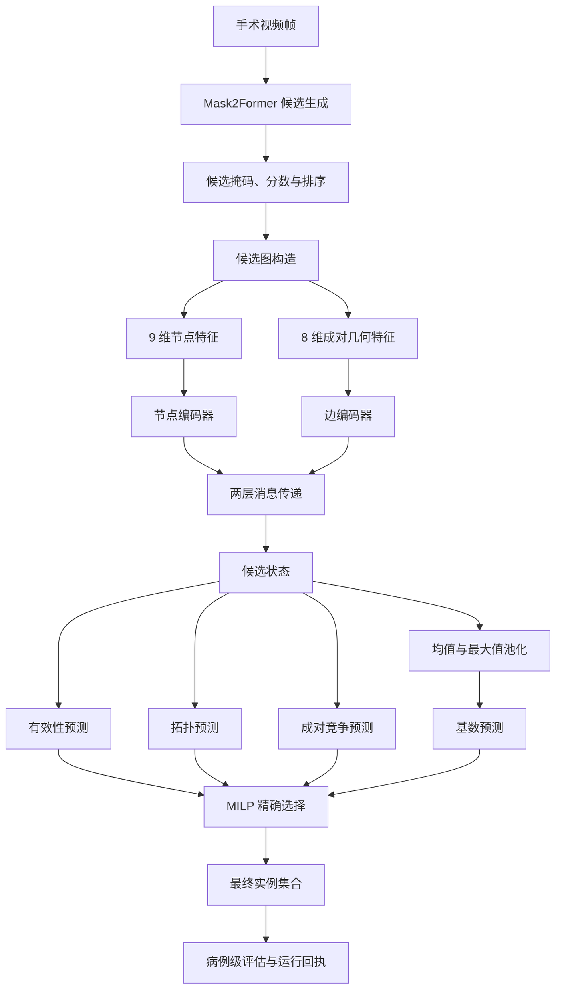

# 端到端流程

## 总览

## 模块输入与输出

| 模块 | 输入 | 输出 | 代码位置 |
|---|---|---|---|
| 候选图构造 | 候选掩码、分数、排序 | 节点、边、可选状态 | `build_candidate_graph` |
| 图路径 | 节点和边特征 | 四类预测结果 | `TopologyAwareCandidateGraph` |
| 节点路径 | 节点特征 | 相同类型的预测结果 | `NodeOnlyMLP` |
| 集合池化 | 可选候选状态 | 128 维集合表示 | `_SharedHeads` |
| 基数预测 | 集合表示 | 11 个基数类别的未归一化分数 | `_SharedHeads.cardinality` |
| 精确选择 | 有效性、竞争关系、可选状态、预测基数 | 最终候选子集与求解状态 | `exact_structured_select` |

## 代码覆盖

本仓库直接实现候选图之后的流程。上游 Mask2Former 作为固定候选生成器出现于论文整体流程，但其原始训练和推理资产不在当前公开包中。

## 最小示例

`python -m cmig_qgraph` 会构造三个合成候选，其中两个有效、一个为空。示例依次运行图路径、节点路径和 MILP，最后报告候选数、边数、基数类别和选择结果。
